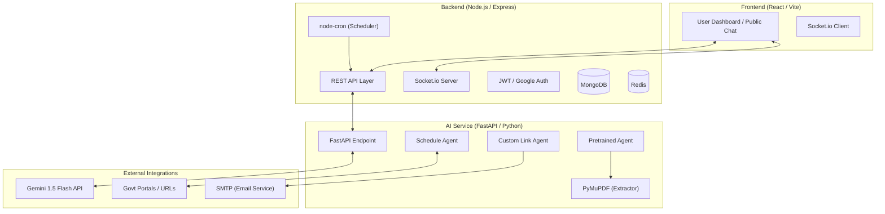

# Aria Architecture & Agent Ecosystem

This document outlines the high-level architecture of the Aria Multi-Agent Platform, detailing the roles of specialized agents, their communication protocols, and the robust error-handling logic that ensures enterprise-grade reliability.

## 1. System Architecture Diagram

---

## 2. Agent Roles & Specializations

Aria utilizes a **Multi-Agent Orchestration** pattern where each agent is purpose-built for a specific domain:

| Agent Type | Primary Role | Core Methodology | Key Tools |
| :--- | :--- | :--- | :--- |
| **Schedule Agent** | Compliance Watchdog | Comps valid company policy against real-time govt sources. | Gemini 1.5, httpx, Govt URLs |
| **Pretrained Agent** | Document Processor | Linear pipeline: Extraction $\rightarrow$ Compliance $\rightarrow$ Risk. | PyMuPDF, JSON Schemas |
| **Custom Link Agent** | Interaction Assistant | Guided onboarding via unique employee-specific chat URLs. | Gemini 1.5, Regular Expressions |

---

## 3. Communication Protocols

1.  **Client-Server**: The Frontend communicates with the Node.js Backend using **REST** for data fetching and **Socket.io** for real-time processing updates (e.g., watching an agent "think").
2.  **Service-to-Service**: The Node.js Backend invokes the AI Service via **Synchronous HTTP (REST)**. Long-running tasks are tracked via `runId`.
3.  **Intelligence Layer**: The AI Service interacts with **Gemini 1.5 Flash** using temperature-optimized prompts to ensure deterministic JSON outputs.

---

## 4. Error-Handling & Resilience Logic

Aria implements a "Defense-in-Depth" strategy for reliability:

### A. Self-Correction & Retries
- **JSON Validation**: Every AI response is processed through a cleanup layer that strips markdown tags and ensures valid JSON structure.
- **Retry Mechanism**: The `Pretrained Agent` uses a **3-Tier Retry** approach. If an extraction fails or the JSON is malformed, it automatically re-prompts the AI with the error context.

### B. Graceful Degradation
- **Network Timeouts**: Integration calls (like fetching PDFs) use a strict **15-20s timeout** handled by `httpx.AsyncClient`.
- **Fallback Replies**: If the AI model is unreachable, the `Custom Link Agent` falls back to a preset professional message: *"I'm sorry, I'm having trouble right now. Please try again soon."*

### C. Audit Logging
- Every agent run generates a structured **Audit Log** containing:
    - `agent`: The sub-agent name (e.g., "Compliance Agent").
    - `timeTakenSec`: Performance metrics.
    - `retryCount`: Visibility into internal failures.
- Logs are persisted in **MongoDB** for legal compliance and debugging.

---

## 5. Tool Integrations

> [!TIP]
> **Aria's unique power comes from its specialized toolchain:**
> - **PyMuPDF**: Enables deep text extraction from complex enterprise PDFs.
> - **SMTP Relay**: Seamlessly polishes and sends human-like emails using AI-refined content.
> - **Redis**: Manages the state of "Schedule" watchdogs to prevent redundant API calls.
